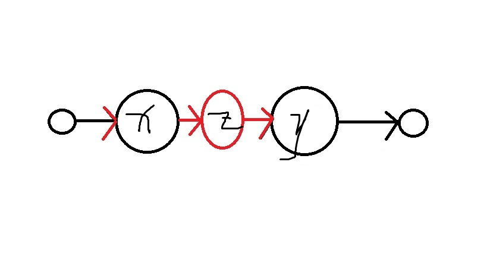

# 顺序存储、链式存储、动态开点

2018.06.25 作者：王樾

---

## 内容引入

在计算机的存储中，会用到很多种储存方式。

而使用存储方式当然不是自己想要什么就要什么，更多的是要适应储存功能，使得我选用的储存方式方便维护而且跑得快。

所以我们应该好好地学存储方式。

## 顺序存储

语言基础打好的同学应该对这个东西很熟悉。其实数组就是顺序存储的。

定义数组(array)就是让系统给你开辟出一片连续的内存空间，然后我们就可以使用了。

一句`int a[105];`，就直接给你以`a`开始的105个元素。

他们的地址分别是多少？

`&a[0] = a` `&a[1] = a + 1` `&a[2] = a + 2`……

左边的&符号是取地址的意思，右边的a是一个指针，指向一个地址。

指针是可以加的，相当于内存空间的下一位。

同样，还有一个符号可以介绍。

`*a = a[0]` `*(a + 1) = a[1]` `*(a + 2) = a[2]`……

这里的*符号是取一个地址中的值的意思。

指针的内容顺带一提，因为顺序储存没什么好讲的。。。

## 链式存储

首先让我们看一个例子：（其实就是链表）

> 让你维护一个序列，要求支持下列三种操作：
> 1. 在值为某个数的元素前或后插入一个元素。
> 2. 删除值为某个数的元素。
> 3. 从左到右遍历这个序列。

如果使用顺序存储方式，那么在两个元素中插入元素是十分浪费时间的。

因为最坏情况下，在第一个元素前插入、删除元素的话，需要将所有已存在的元素全部后移或前移一位，复杂度为$O(n)$，是很慢的算法。

这个时候，如果我们使用链式存储的话，就能够解决这个问题。

其实链式结构记录的是每个元素的相对关系，下标不一定连续。

我们定义一个结构：

```cpp
struct Nodes
{
    int next, val;
} s[maxn];
int head, tot;
```

这里的next表示一个元素的下一个元素的**下标**，val表示这个元素的值，tot用来分配下标。

插入一个元素，在链式储存中，更改前和更改后分别是这两个样子：




所以，插入一个元素，其实就只要两个操作：

1. 分配一个新结点。同时记录新结点的前驱、后继。

2. 将前驱点的next设为这个结点，将这个结点的next设为后继点。

同样，删除一个元素也很简单。图片也可以自己画出来。

直接给出删除操作的思路：

1. 记录将删除结点的前驱、后继，然后设置为0。

2. 将前驱的next设置为后继。

3. 删除结点（释放空间）。

遍历链表的话就只需要记录一个链头，然后一直遍历下去直到尽头为止就可以了。

上面的单向链表是基础的操作，还有双向链表，循环链表等操作方法，可以自己去了解一下。

## 动态开点

有一些链式结构会使用动态开点的操作方法。这种操作方法需要有指针的基础。

动态开点，其实就是动态地申请内存和释放内存。

一般操作方法是构造一个struct：

```cpp
struct Node
{
    int val;
    Node *left, *right;
};
Node *head;
```

每个Node类型内含了两个Node的指针，注意不能定义Node类型，否则会无限递归，程序会死掉。

核心操作有两个：

1. 新建结点：`Node *p = new Node();` 使用`new Node()`会返回一个指针。

2. 释放结点：`delete p;`

愿意的话可以认真去看看文件夹中的ppt，因为动态开点实际应用不多。

更多的是使用数组模拟链表。就像上面的tot一样去分配静态的内存。

## 存储方式比较

我来列一个表格。

| 存储方式 | 插入元素 | 删除元素 | 查询元素 | 遍历元素 | 
| ------- | ------- | ------- | --------- | -------- |
| 顺序存储 | 最坏$O(n)$ | 最坏$O(n)$ | $O(1)$ | $O(n)$ |
| 链式存储 | $O(1)$ | $O(1)$ | 最坏$O(n)$ | $O(n)$ |

## 最后的话

存储方式是主要内容，但也是很多后续内容的基础，例如二叉树、邻接表等。

可以去做几道题去练练不同存储方式的应用。

经典的“约瑟夫问题”就可以运用单向链表解决，可以去试试。

再见！