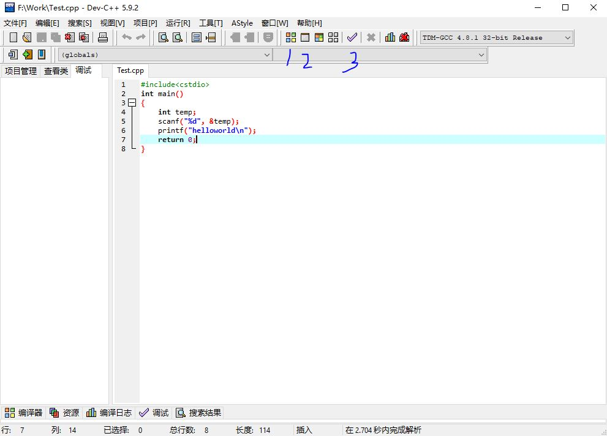
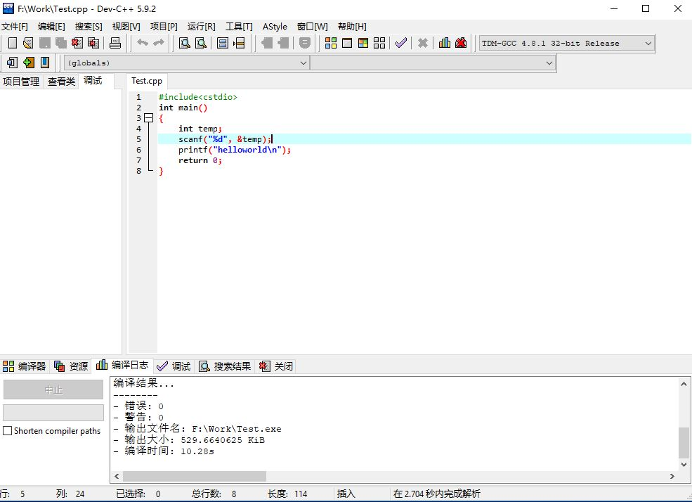
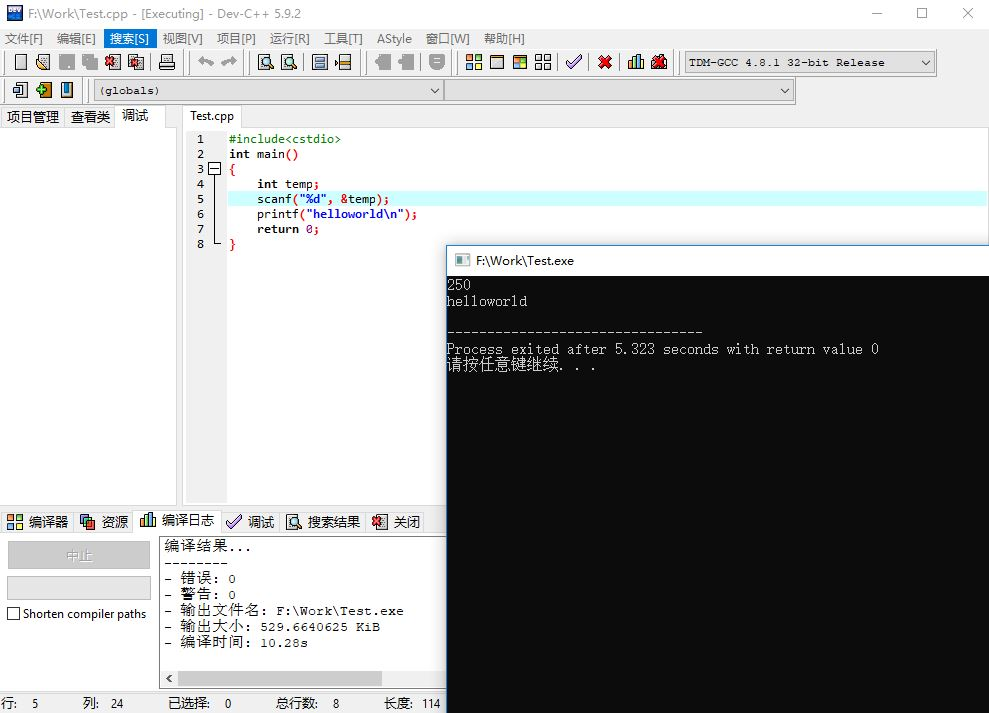
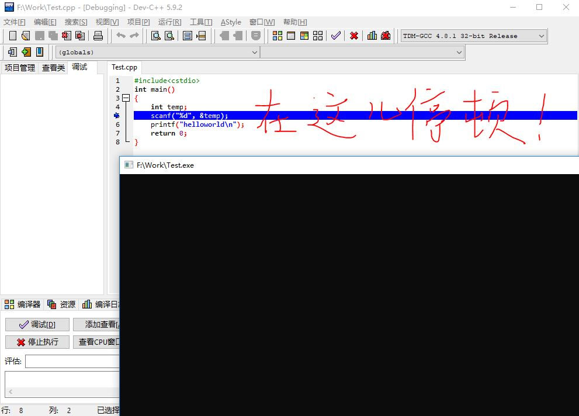

# DevC++安装及使用（最简便）

2018.07.07 作者：王樾

---

### 前面的话

欢迎步入信息学竞赛的世界！祝大家~~玩的开心~~！

想编写程序，难道直接弄个notepad就开始写了吗？

当然不是。你需要搭建编译环境！

这里介绍的是DevC++的安装，一般的DevC++自带了一个编译器。

这种东西叫做IDE(intergrated development environment，集成开发环境)，好处就是直接安装这个东西就可以直接搭建编译环境。

## 安装

你可以直接去百度找“DevC++”，但是这个软件很蛋疼，因为它年代已经很久远，有的版本是很老旧的，有的版本在调试的时候又有bug。

不过师兄师姐手头上有一个bug较少的版本，可以在微信公众号上回复“IDE”找到。

下载下来就可以安装，只有一个东西要注意一下：安装类型选full，这个东西自带了编译器。

## 使用

我们使用这个DevC++的方便之处呢，在于可以对单个源文件进行编译运行和调试。相比其他的IDE是不允许的。

附一张图，没图说个jb。。。

最常用的当然就只有三个：编译、运行、调试。分别是图中写的1、2和3。

### 编译(compile)

你只要按一下就可以了，也有快捷键为`F9`。

编译完就出现了个下面的话，提示你编译好了。像这样：（编译了10s好慢啊）

### 运行(run)

同上，也有快捷键`F10`。

按完就出现你的程序，它执行它应该做的事后就结束了。像这样：

---

这里插一个小东西。

老版的DevC++里面，运行程序会一闪而过。它存在过，但是你还没看到它的内容它就消失了。

原因是一个程序在`main`函数`return 0`之后就会直接关闭。

那为什么我们现在还能看到它？因为我们人为地暂停了它的结束。

其实它在`return 0`的前面写上了些东西，这些东西能够使程序暂停。

常见的就不说了，可以上网了解一下。

---

它后面还有一个长的差不多的，叫做“编译运行”(compile & run)，我经常用这个。

### 调试(debug)

主要注意的地方是调试。

DevC++我最喜欢的一点就是它的单步调试了，相比其他的IDE和gdb（命令行的调试）既不卡又高效。

了解一个概念叫“断点”(breakpoint)，就是你调试的程序走到这一行会自动停下来然后等你调试。

如何设置？按下左边的行数，这一行会变红。断点就设置好了。例如我可以在`scanf`那一句设置断点。

如何开始调试？按下那个勾！

之后你的程序就会启动，然后就会发现你的程序走不动了！像这样：

接下来就可以开始你的调试了。

看看IDE下面的调试菜单，我们主要介绍三个东西：

1. 添加查看。功能就是可以输入一个变量（或常量），然后可以查看它的值而不需要打印出来。例如定义了一个`int`类型的`sum`变量，可以在编辑器中选中sum然后按下这个按钮。或者在你左边的格子里右键“新建查看”，输入“sum”。显然前者更简单。。。

2. 下一步（快捷键`F7`）。嗯，就是下一步，与下面的单步进入有不同之处。

3. 单步进入（快捷键`F8`）。主要区别在于“单步”，比如我现在这一步要运行一个函数，如果我单步进入的话会进入这个函数，一步一步地把这个函数走完，而下一步的话会当它是一个基本语句一样执行完就进入下一个语句。

随便按按这个程序就走完了。。。

调试的意义在于让你知道计算这个答案的过程，也许通过错误的算法得到了错误的答案，想知道到底哪里错了，就可以调试一下。

具体的调试技巧要大家自己做题去积累，我也说不出来哩。~~其实是因为太菜~~

## 注意事项

也许你的字体又长又细，那么极大可能是因为你的字体设置出问题了。

打开工具->编辑器选项->显示，里面就可以改字体了。

我喜欢的字体是consolas，不过在DevC++里面放大不好看比较可惜。

那种有问题的字体好像是Courier New，作等宽字体好像不错。反正改过来就是了。

## 后面的话

有一个简单的编写程序的环境，是学习编程的第一步！

当然还有好多好多步等你去走。。。

如果是完全没接触过相关内容的，可以不去看那一篇装VS Code的了，免得看得头皮发麻。。。

再见！