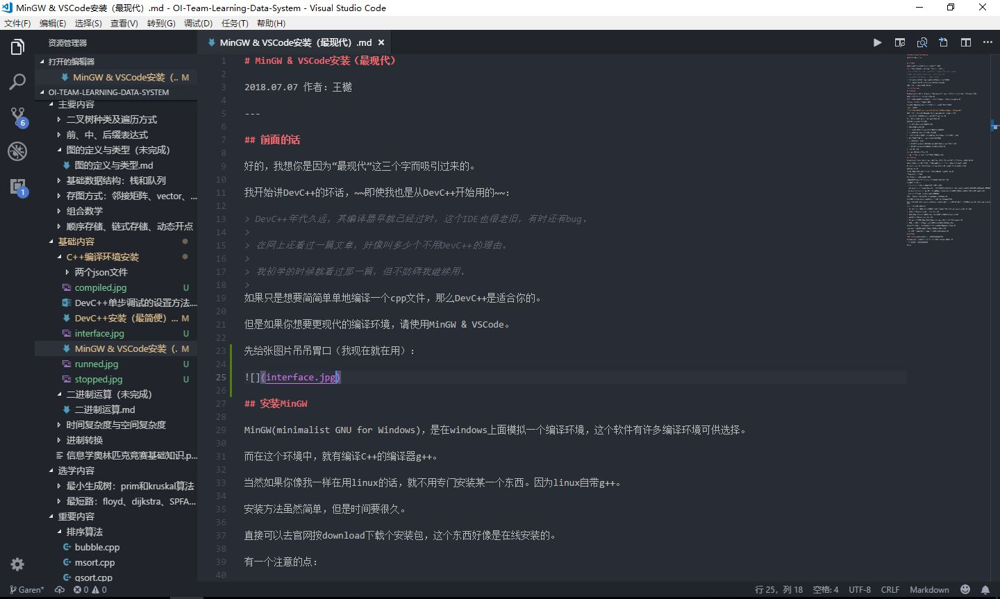

# MinGW & VSCode安装（最现代）

2018.07.07 作者：王樾

---

## 前面的话

好的，我想你是因为“最现代”这三个字而吸引过来的。

我开始讲DevC++的坏话，~~即使我也是从DevC++开始用的~~：

> DevC++年代久远，其编译器早就已经过时，这个IDE也很老旧，有时还有bug。
> 
> 在网上还看过一篇文章，好像叫多少个不用DevC++的理由。
> 
> 我初学的时候就看过那一篇，但不妨碍我继续用。
> 
如果只是想要简简单单地编译一个cpp文件，那么DevC++是适合你的。

但是如果你想要更现代的编译环境，请使用MinGW & VSCode。

先给张图片吊吊胃口（我现在就在用）：

## 安装MinGW

MinGW(minimalist GNU for Windows)，是在windows上面模拟一个编译环境，这个软件有许多编译环境可供选择。

而在这个环境中，就有编译C++的编译器g++。

当然如果你像我一样在用linux的话，就不用专门安装某一个东西。因为linux自带g++。

安装方法虽然简单，但是时间要很久。

直接可以去官网按download下载个安装包，这个东西好像是在线安装的。

有一个注意的点：

**选择安装组件的时候，请打勾(mark)所有的选项，然后在左上角第一个菜单按apply。**

你全部安装下来最保险了，反正也占不了多大空间，免得差了东西又回去下载。

如果成功地安装到最后的话，请打开cmd，在里面打一个"g++"。

最开始应该会告诉你：“g++”不是一个可执行的语句。

那么按照下列方法添加环境变量：

1. 右键桌面上的“计算机”，点击“属性”。

2. 在左边点击“高级设置”。

3. 进入“性能”，在最下面有一个“环境变量设置”，点击它。

4. 打开你的MinGW目录，默认安装在C:/MinGW。

5. 复制其中bin文件夹的绝对路径，按资源管理器上面那一行路径，然后全部复制。

6. 在下面的系统变量中，找到一个叫做“Path”的变量。

7. 这个时候要分类讨论了：

- 如果所用系统为windows7，在最后添加一个英文中的分号（;），然后Ctrl+V。

- 如果所用系统为windows10，点击“添加”，粘贴，确定添加。

8. 退出这些东西。

接下来回到你的cmd，打出"g++"。

如果回复是**“g++ no input file”**的话，恭喜你成功了！

## 安装VSCode

VScode(Visual Studio Code)，是一个轻量级代码编辑器，是Microsoft的**开源**产品！~~我现在就在用。~~

相信大家相比起来，更听说过VS。但是VS占空间极大，如果不是专业开发人员使用，可能不值得。

Microsoft这几年拥抱开源了，VSCode就是其中一个产品，这些东西也许是收购GitHub的伏笔吧。

好的，回到正题。

直接点开官网，首页就可以下载，只不过x86（32位）的同学可能要找一下。

安装也简单，就不讲了。

点开VSCode，开始我们下一步的操作。

我们可以在VSCode上安装插件，因为开源，所以才有那么多的插件。

我推荐的插件有以下：

- C/C++：有这个插件才有C++的自动补全、调试等功能。

- Code Runner：这个插件太好用了！有相关编译环境的时候，只需要直接右键“Run Code”，就可以运行你的程序，现在你可以去试试看。

- One Dark Pro：恩，这个是一个主题插件，内含一个叫做“One Dark Pro”的主题。在左下角的设置中的“颜色主题”可以更改。

- Vim：大家用过Vim吗？我觉得大家可以去试试看。

对于不同的语言，有许多好用的插件，可以自己去百度了解一下。

运行程序，使用Code Runner就可以解决，但是调试部分就需要自己动手。

文件夹中附上了两个文件：launch.json和tasks.json。前者作用是开始调试，后者作用是编译程序。因为只有在编译时加上一个“-g”，才能用来编译。

接下来是配置调试功能的教程：

1. 点开左边从上往下第四个按钮，点击那个齿轮，选择gdb，然后就跳出来一个launch.json的编辑窗口。

2. 把文件夹中的launch.json全部东西都复制进去。

3. 在左边点一下运行，会提示你没有一个叫build的任务，点击“配置tasks.json”。

4. 也把文件夹中的tasks.json复制进去。

5. 点开一个c++源程序，在一行的左边点一下，会有一个红点，这叫做断点(breakpoint)。

6. 点击开始调试，如果出现一个终端，程序运行暂停的话，那么你成功了！

VSCode里面有单步进入(F10)和单步跳过(F11)，具体的调试自己要去实践一下。

有一个监视栏，可以在每一步中观察一个变量的值，非常有用。

注意：调试是不能回跳的，如果想回到过去的话，只能够重新运行。

## 后面的话

写的东西挺多，想当初我折腾这个东西的时候也非常痛苦。

VScode也有好多东西可以用，不只是用来写C++。比如用Git管理你的项目。

不过该折腾的还是得折腾的。。。

再见！